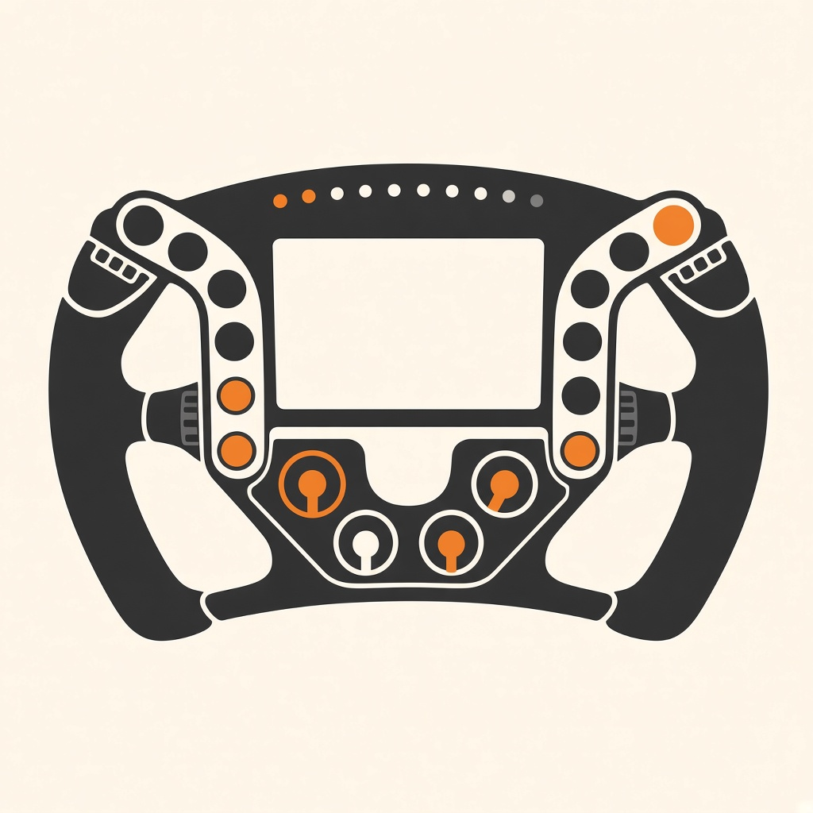

# rp2040-ffb

<p align="center">
  
</p>

<p align="center">
  <a href="https://github.com/skyne/rp2040-ffb/actions"></a>
  <a href="https://github.com/skyne/rp2040-ffb/blob/main/LICENSE"></a>
  <a href="https://github.com/skyne/rp2040-ffb/releases"></a>
  <a href="https://github.com/skyne/rp2040-ffb/stargazers"></a>
  <a href="https://github.com/skyne/rp2040-ffb/wiki"></a>
  <a href="https://platformio.org/"></a>
</p>

**Open DIY force-feedback steering wheel** built around two Raspberry Pi Pico (RP2040) boards — a **base MCU** that owns sensing, motors, pedals, and USB HID, and a **rim MCU** for buttons, encoders, and shift lights, linked over a framed UART protocol.

Mechanics are a **Logitech G920 or G923** base with the plastic rotation endstop limiter removed, plus an axle-mounted magnet for the index hall. The rest is Pico firmware, Logitech pedals, a Tauri desktop configurator, and a one-button firmware pack. Force feedback includes local **spring / manual / track** for bench work and **USB HID PID effects** from the host (games FFB).

---

## Architecture

```
┌─────────────────────────────┐       UART 460800 CRC16      ┌─────────────────────────────┐
│         base-mcu            │◄────────────────────────────►│          rim-mcu            │
│  Raspberry Pi Pico          │   GP0/GP1 + RUN/BOOTSEL      │  Raspberry Pi Pico          │
│                             │                              │                             │
│  • MLX90363 steering hall   │                              │  • Core0: inputs + UART 500Hz│
│  • Axle index magnet        │                              │  • Core1: WS2812 + ILI9341 │
│  • Dual BTS7960 (IBT-2)     │                              │  • MCP23017 buttons / LEDs  │
│  • Logitech pedal ADC       │                              │  • ADS1115 paddle halls    │
│  • USB HID gamepad + CDC    │                              │  • 4× EC12 encoders         │
│  • Status NeoPixel ring     │                              │  • WS2812 shift strip       │
│                             │                              │  • Optional ADXL345 (I2C)  │
│                             │                              │  • OTA staged flash         │
└──────────────┬──────────────┘                              └─────────────────────────────┘
               │ USB CDC 115200
               ▼
        ┌──────────────┐
        │  ffb-config  │  Tauri GUI — settings, diagnostics, pack flash
        └──────────────┘
```

| Board | Role |
|-------|------|
| **base-mcu** | USB HID joystick, FFB motor drive, hall angle + homing, pedals, UART host for the rim |
| **rim-mcu** | Dual-core: Core0 panel/encoder I/O + link @ 500 Hz; Core1 WS2812 + ILI9341 layout; config EEPROM; OTA |

Shared protocol: [`shared/ffb_link.h`](shared/ffb_link.h) · full spec: [`docs/link-protocol.md`](docs/link-protocol.md)

---

## Getting Started

### For Builders (First Time)

**Want to build your own rp2040-ffb wheel?** Start here:

1. **Read the [Build Guide](docs/build-guide.md)** — Complete step-by-step assembly instructions
2. **Check the [FAQ](docs/faq.md)** — Common questions about hardware, cost, and compatibility
3. **Review the [Wiring Diagrams](docs/wiring-diagrams.md)** — Pinouts and connection references
4. **Order parts** — See BOM in Build Guide
5. **Join the community** — GitHub Discussions for questions and sharing

**Estimated:**
- Cost: $350-590 USD
- Time: 15-25 hours
- Skills: Basic soldering, electronics, PC terminal usage

### For Developers

**Want to contribute or modify the firmware?**

1. **Read [CONTRIBUTING.md](CONTRIBUTING.md)** — Contribution guidelines and workflow
2. **Review [Firmware Development Guide](docs/firmware-development.md)** — Architecture and coding standards
3. **Try the [Simulator](docs/simulator-integration.md)** — Hardware-free development mode
4. **Run tests** — `pio test` (firmware), `npm test` (GUI)
5. **Open a PR** — Follow the PR template

### For Existing Owners

**Already built? Here's how to get the most out of it:**

1. **[Calibration & Tuning](docs/calibration-and-tuning.md)** — Optimize FFB feel and accuracy
2. **[Thermal Management](docs/thermal-management.md)** — Temperature monitoring and cooling
3. **[Troubleshooting](docs/troubleshooting.md)** — Fix common issues
4. **[GUI Configurator](tools/ffb-config/README.md)** — Settings and diagnostics
5. **Share your build!** — Post photos and feedback in Discussions

---

## Status

| Area | State |
|------|--------|
| Steering (MLX90363 + gear ratio) | Working |
| Axle index / manual INIT | Working |
| Motorized INIT / seek | WIP |
| Pedals (G29/G920/G923 DE-9) | Working with auto-cal |
| USB HID (steer + 3 pedals + Rx/Ry clutch paddles + 32 buttons) | Working |
| Dual BTS7960 motor drive | WIP |
| FFB modes | **Off / Manual / Spring / Track / Pid** (USB HID PID effects) |
| Rim buttons + encoders | Working (Core0 @ 500 Hz) |
| Rim WS2812 shift lights | Working (Core1 ~60 FPS) |
| Rim display (ILI9341) | Optional — multi-page dashboard (icons/bg themes; ffb-config Display tab) |
| Base↔rim UART | 460800 + CRC16 + RX ring buffer |
| Firmware pack + GUI OTA | Working |
| PCB / CAD | Coming soon — pin maps in `config.h` are source of truth |

---

## Repository layout

| Path | Description |
|------|-------------|
| [`assets/logo.png`](assets/logo.png) | Project logo |
| [`firmware-base/`](firmware-base/) | Base Pico firmware (PlatformIO + Arduino-Pico) |
| [`firmware-rim/`](firmware-rim/) | Rim Pico firmware |
| [`shared/`](shared/) | Link protocol headers + build stamp |
| [`tools/ffb-config/`](tools/ffb-config/) | Cross-platform Tauri configurator |
| [`tools/firmware-sim/`](tools/firmware-sim/) | Python-based firmware simulator for hardware-free development |
| [`scripts/pack-firmware.sh`](scripts/pack-firmware.sh) | Build both MCUs → release zip |
| [`docs/`](docs/) | **Comprehensive documentation** (see below) |

### Documentation

| Document | Description |
|----------|-------------|
| [`docs/project-overview.md`](docs/project-overview.md) | **Project overview** — high-level introduction, architecture, getting started |
| [`docs/comparison.md`](docs/comparison.md) | **Comparison guide** — rp2040-ffb vs. commercial wheels (G29, T300, CSL DD) |
| [`docs/build-guide.md`](docs/build-guide.md) | **Complete build guide** — step-by-step hardware assembly, parts list, tools, safety |
| [`docs/wiring-diagrams.md`](docs/wiring-diagrams.md) | **Wiring diagrams** — pinouts, connections, power distribution, cable specs |
| [`docs/calibration-and-tuning.md`](docs/calibration-and-tuning.md) | **Calibration & tuning** — gear ratio, pedals, FFB parameters, per-game settings |
| [`docs/firmware-development.md`](docs/firmware-development.md) | **Firmware development** — architecture, code organization, debugging, testing |
| [`docs/troubleshooting.md`](docs/troubleshooting.md) | **Troubleshooting guide** — common issues, diagnostics, recovery procedures |
| [`docs/simulator-integration.md`](docs/simulator-integration.md) | **Simulator integration** — hardware-free dev mode with Python simulator |
| [`docs/faq.md`](docs/faq.md) | **Frequently Asked Questions** — hardware, software, safety, community |
| [`docs/link-protocol.md`](docs/link-protocol.md) | UART protocol specification — frames, CRC16, message IDs |
| [`docs/firmware-pack.md`](docs/firmware-pack.md) | Firmware pack format and GUI update flow |
| [`docs/rim-hardware-plan.md`](docs/rim-hardware-plan.md) | Rim panel hardware design notes |
| [`CONTRIBUTING.md`](CONTRIBUTING.md) | **Contribution guidelines** — code style, testing, PR process, community |
| [`CHANGELOG.md`](CHANGELOG.md) | Version history and release notes |

---

## Bill of materials

No formal PCB BOM lives in the tree yet. The following is what the firmware targets today.

### Electronics

| Qty | Part | Notes |
|-----|------|--------|
| 2 | **Raspberry Pi Pico** (RP2040) | Base + rim; `board = rpipico` |
| 1 | **MLX90363** magnetic rotary sensor | Absolute angle on the G920/G923 sensor board |
| 1 | Digital hall (e.g. **A3144**-style OC) | Reads the axle index magnet; active-low into GP20 |
| 2 | **BTS7960 / IBT-2** H-bridge modules | One per FFB motor; logic @ 3V3, motor rail **12–24 V separate** — WIP |
| 1 | **Logitech G29 / G920 / G923 pedals** | DE-9: GND / Thr / Brk / Clu / VCC from Pico **3V3** |
| 1 | **HW-159** 7× WS2812 ring | Base status LEDs (GP21) |
| 1 | **WeAct Studio 3.7"** e-paper (GDEY037T03 / UC8253C) | Base status panel; **3V3** VCC; SCL/SDA on GP4/GP5 (PIO SPI, not hall) |
| 1 | **WS2812B** strip (default 11 LEDs) | Rim shift / flags (GP14); 5 V + ~330 Ω series on DIN |
| 2 | **MCP23017** slim I²C modules | `0x20` switches · `0x21` LEDs (10× TSD-1166); soft-fail if absent |
| 1 | **ADS1115** | Four linear halls (clutch L/R, shifter A/B) @ `0x48`; soft-fail if absent |
| 4 | **EC12** rotary encoders | Quadrature A/B on GP6–13 (no shaft switch) |
| — | Wiring, commons GND, optional series resistors | Motor B+/B− **never** onto Pico pins |
| 0–1 | **ILI9341** TFT | Optional on SPI1; multi-page DisplayStore + active `layout_hex` |
| 0–1 | **ADXL345** | Optional on rim I²C `0x53` |

### Mechanical

| Item | Notes |
|------|--------|
| **Logitech G920 or G923** wheel base | Stock dual-motor gearbox (~18:1; `gear_ratio`) |
| Plastic endstop limiter | **Removed** so the axle can turn freely past the stock stops |
| Index magnet on axle | Only hardware add to the donor gearbox; align `AXLE_INDEX_ANGLE_DEG` after measuring |
| Wheel rim / button panel | Hosts MCP23017 + ADS1115 + encoders + LED strip |
| PSU for motors | Sized for dual BTS7960 load; isolated from USB logic |

Pin assignments are defined in:

- [`firmware-base/src/config.h`](firmware-base/src/config.h)
- [`firmware-rim/src/config.h`](firmware-rim/src/config.h)

**Rim panel I/O:** [`docs/rim-hardware-plan.md`](docs/rim-hardware-plan.md) — dual MCP23017 + ADS1115 (each soft-fails if unpopulated).

---

## Wiring summary

### Base ↔ rim link

| Signal | Base | Rim |
|--------|------|-----|
| UART TX / RX | GP0 → rim RX, GP1 ← rim TX | GP0 / GP1 (crossed) |
| Rim RESET (RUN) | GP2 | Pico RUN |
| Rim BOOTSEL | GP3 | Pico BOOTSEL |
| GND | common | common |

Baud: **460800** (base↔rim UART), 3V3 logic. Host CDC stays **115200**.

### Base highlights

| Function | Pins |
|----------|------|
| Hall SPI (MLX90363) | MISO 16, SS 17, SCLK 18, MOSI 19 @ 500 kHz |
| Hall wire colors | red 5V · black GND · blue MISO · yellow /SS · orange SCLK · green MOSI |
| E-paper (WeAct 3.7") | SCL 4 · SDA 5 · CS 6 · DC 7 · RST 8 · BUSY 9 · VCC **3V3** (own PIO SPI; not hall bus) |
| Axle index | GP20 (`INPUT_PULLUP`, active-low) |
| Status NeoPixel | GP21 (×7) |
| Pedals ADC | Thr 26 · Brk 27 · Clu 28 |
| Pedal DE-9 | 1 GND · 2 Thr · 3 Brk · 4 Clu · 6&9 VCC (Pico 3V3) |
| Motor 1 | RPWM 10 · LPWM 11 · EN 12 |
| Motor 2 | RPWM 13 · LPWM 14 · EN 15 |

### Rim highlights

| Function | Pins |
|----------|------|
| I²C MCP23017 / ADS1115 / ADXL | SDA 4 · SCL 5 (`0x20` / `0x21` / `0x48` / `0x53`) |
| Encoders 0–3 A/B | 6/7 · 8/9 · 10/11 · 12/13 |
| WS2812 DIN | GP14 (default 11 LEDs) |
| LDR / panel LED PWM | GP26 / GP27 (global LED rail FET) |
| TFT (optional) | SCLK 18 · MOSI 19 · MISO 16 · CS 17 · DC 20 · RST 21 · BL 22 |

**Rim LED layout:** LEDs 0–1 flags · 2–8 RPM (or pit yellow blink) · 9–10 TC / ABS. Flag/aid pairs blink together (single signal = both LEDs that color; two signals alternate; red = both urgent).

---

## Prerequisites

- [PlatformIO Core](https://platformio.org/install/cli) (`pio`)
- USB access to the Picos (Linux: user in `dialout` for `/dev/ttyACM*`)
- For the GUI: **Node.js**, **Rust**, and [Tauri Linux deps](https://tauri.app/start/prerequisites/) (webkit2gtk, gtk, etc.)

Firmware platform: [`maxgerhardt/platform-raspberrypi`](https://github.com/maxgerhardt/platform-raspberrypi) with **Earle Philhower** Arduino-Pico core. Library: Adafruit NeoPixel.

---

## Build firmware

```bash
# Individual images
pio run -d firmware-base
pio run -d firmware-rim

# Release pack for the GUI (stamps both MCUs with the same fw_id)
./scripts/pack-firmware.sh           # tag = UTC date
./scripts/pack-firmware.sh v0.2.0    # custom tag
```

GitHub Releases (desktop binaries + firmware pack) are built by
[`.github/workflows/release.yml`](.github/workflows/release.yml) when you push a `v*` tag:

```bash
git tag v0.1.0 && git push origin v0.1.0
```

| Artifact | Path |
|----------|------|
| Base UF2 | `firmware-base/.pio/build/pico/firmware.uf2` |
| Rim BIN | `firmware-rim/.pio/build/pico/firmware.bin` |
| Pack zip | `dist/ffb-firmware-<tag>.zip` |

Pack contents: `manifest.json` + `base.uf2` + `rim.bin` (SHA-256 verified). Details: [`docs/firmware-pack.md`](docs/firmware-pack.md).

---

## Flash / update

| Method | When to use |
|--------|-------------|
| **ffb-config → Update both (pack)** | Recommended day-to-day: rim OTA, then base BOOTSEL UF2 |
| `pio run -d firmware-base -t upload` | Direct base USB |
| `pio run -d firmware-rim -t upload` | Direct rim USB / recovery |
| Hold **BOOTSEL** + copy UF2 to `RPI-RP2` | Manual / brick recovery |
| CDC `:bootsel` / `:rim_bootsel` | Enter UF2 from software (if wired) |

Rim OTA updates the app image only — **rim EEPROM settings are preserved**. Base settings live in base EEPROM across UF2 flashes.

If the BOOTSEL volume does not appear within ~45 s during a pack update, unzip the pack and copy `base.uf2` manually.

---

## Configurator (ffb-config)

```bash
cd tools/ffb-config
npm install
npm run tauri dev
```

Connect to the **base** CDC port (115200). Close any PlatformIO serial monitor first — only one process can own the port.

GUI covers base/FFB tuning, **profiles** (4 on-device slots), rim encoders & LEDs, **LMU race telemetry**, diagnostics, serial monitor, and firmware pack flash. See [`tools/ffb-config/README.md`](tools/ffb-config/README.md).

**CDC examples:** `:dump` · `:get` / `:set` · `:save` / `:load` · `:version` · `:profile list|load N|save N` · `:leds_*` · `:rim_sync`

**Race mode (LMU):** connect, open the **Race** tab, start listening on UDP 5000 for the [LMU Telemetry Socket](https://community.lemansultimate.com/index.php?threads/telemetry-socket-%E2%80%93-json-telemetry-plugin.8229/) plugin. The app maps JSON → binary `Telemetry` (`0x20`) on the same CDC session (settings + inject coexist). While race mode is on, closing the window hides to the system tray. Still close any PlatformIO serial monitor — only one process can open CDC.

---

## HID map

| Control | Mapping |
|---------|---------|
| Axes | X steering · Y throttle · Z brake · Rz pedal clutch · **Rx clutch L** · **Ry clutch R** |
| Buttons 1–10 | Panel |
| 11/12 … 17/18 | Encoder 0–3 CW/CCW (momentary pulses) |
| 19–22 | Encoder shaft switches (unused on MCP panel) |
| 23–24 | Shifter paddles A/B (from ADS halls; off if ADS absent) |
| 25–32 | Reserved |

Rim paddle axes (Rx/Ry) and shifter buttons stay **0 / released** when the ADS1115 is missing or the rim is unlinked. Stock HID has six axes — dual clutch takes the two free ones; sequential shifters are buttons.

Default HID range: **±450°** (`hid_range` / `WHEEL_HID_RANGE_DEG = 900`).

---

## Safety

- Motor supply (**12–24 V**) is independent of the Pico. **Never** feed B+/B− into GPIO or VBUS logic rails.
- Stock plastic rotation stops are removed — soft limits are software-only. Keep motor duty capped (`MOTOR_DUTY_CAP = 0.35`) until FFB is trusted.
- Boot INIT prefers **ADXL345 gravity zero** when the rim reports the sensor; otherwise the existing **magnet index** window seek is used (500 ms probe timeout). Motorized seek remains WIP (`HOME_BOOT_USE_MOTORS = false`).
- Keep NeoPixel brightness modest on USB 5 V.

---

## Roadmap (high level)

- Motor drive + motorized INIT
- PID polish (Custom Force samples, higher control rate, ffb-config gain UI)
- Optional rim ILI9341 UI (multi-page layouts, built-in icons/backgrounds via ffb-config)
- First-party PCB + published BOM / gerbers
- Additional game backends beyond LMU (SimHub / shared memory) on the same Race path

---

## Documentation

- [Link protocol, settings, LEDs, OTA](docs/link-protocol.md)
- [Firmware pack format](docs/firmware-pack.md)
- [ffb-config GUI](tools/ffb-config/README.md)

---

## License

This project is licensed under the **MIT License** - see the [LICENSE](LICENSE) file for details.

Third-party components retain their own licenses (e.g. Adafruit NeoPixel, Tauri).
